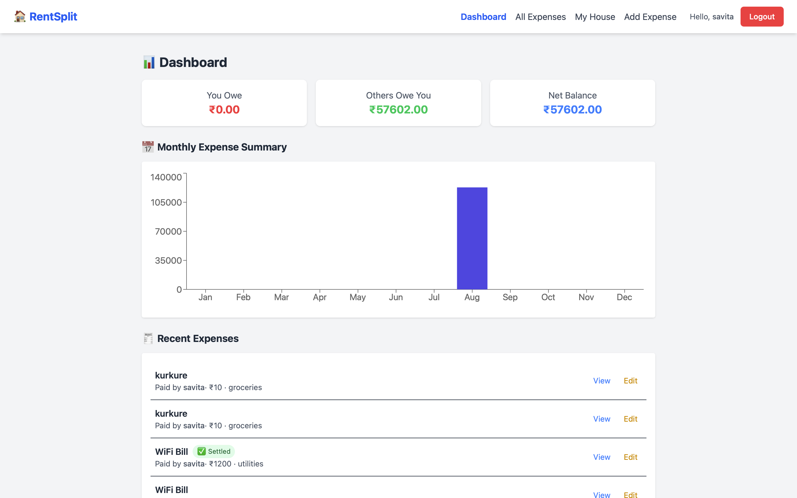
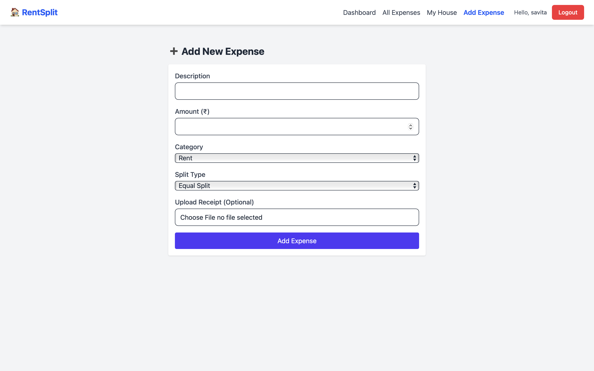
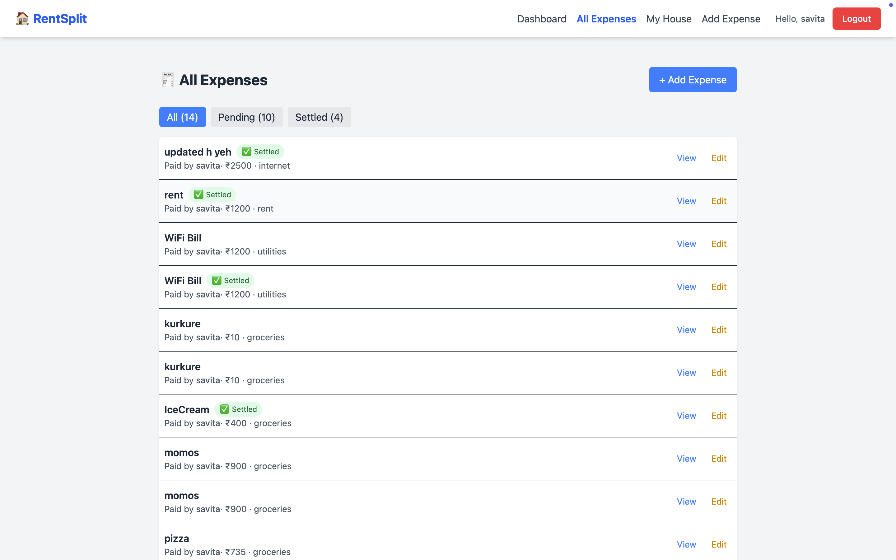
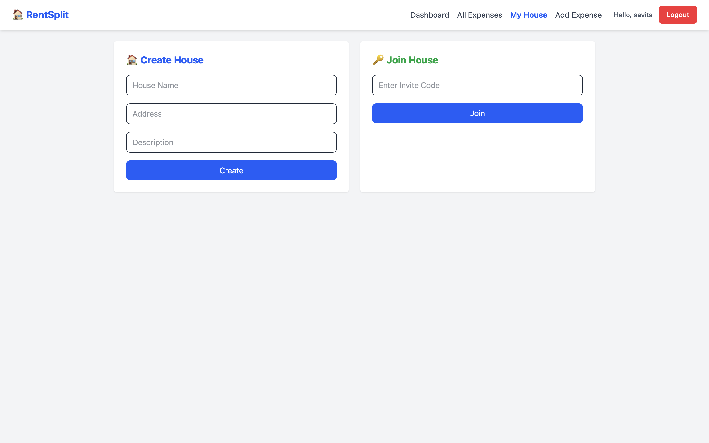

🏠 RentSplit – Rent & Utility Split App

RentSplit is a full-stack MERN application designed to help roommates split rent and utilities easily. Those who faces difficulties in distributing the money among the roommates then it's a great web app for the users you will have a monthly chart according to the expenses you spend . And MOREOVER you can add different houses for differnt houses .SO it is very good if you want expense management for a Flat or Pg .
It supports expense receipts, monthly spending charts, and custom split ratios (50-30-20).  

🚀 Features

- 🧾 Upload expense receipts (Cloudinary + Multer)
- 📈 Monthly spending charts
- 🪙 Custom split ratios (50-30-20)
- 👥 Calculate balances between roommates
- 🔐 Secure authentication

 📦 Tech Stack

- Frontend: React (Vite), TailwindCSS  
- Backend: Node.js, Express.js  
- Database: MongoDB  
- File Uploads: Multer + Cloudinary  

## 🖼️ Screenshots

### 1️⃣ Dashboard View


### 2️⃣ Add Expense Page


### 3️⃣ ALL Expnese Page


### 4️⃣ Create Different Houses For Many Users



🔧 Setup Instructions

 1️⃣ Clone the Repository
```bash
git clone https://github.com/Vinishvats14/RentSplit.git
cd RentSplit

2️⃣ Install Dependencies
# Install backend dependencies
cd server
npm install

# Install frontend dependencies
cd ../client
npm install

3️⃣ Setup Environment Variables
PORT=5000
MONGO_URI=your_mongodb_connection_string
JWT_SECRET=your_jwt_secret
CLOUDINARY_CLOUD_NAME=your_cloudinary_name
CLOUDINARY_API_KEY=your_api_key
CLOUDINARY_API_SECRET=your_api_secret

4️⃣ Run the App
Open two terminals (one for backend, one for frontend):
# Start backend (server/)
cd server
npm run dev
(first check your dependency script then use this command .Like
 "scripts": {
  "dev": "nodemon server.js" /// if nodemon is installed
  if no nodemon there then simply node server.js will run your code
}
)
# Start frontend (client/)
cd client
npm run dev

App will be live at:
👉 Frontend: http://localhost:5173
👉 Backend API: http://localhost:5000